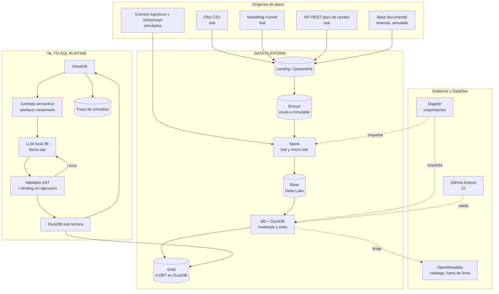

# Arquitectura — TFM NL-to-SQL sobre Lakehouse gobernado

**Versión:** 2.0 · **Fecha:** 2026-09-03

Sustituye a la versión 1.0. Consolida las decisiones D-01 a D-41 y las
conclusiones técnicas C-01 a C-07 recogidas en `DECISIONES.md`. Cuando este
documento y `DECISIONES.md` discrepen, prevalece `DECISIONES.md`, que es el
registro con fecha y justificación de cada cambio.

---

## 1. Objetivo

Construir una plataforma de datos de extremo a extremo que ingiera datos por
lote y por flujo, los gobierne en capas, y exponga una capa analítica sobre la
que un modelo de lenguaje local traduzca preguntas de negocio en castellano a
SQL validado y ejecutado de forma segura.

El sistema debe responder el catálogo de `Preguntas.md`, que actúa a la vez
como requisito funcional de la capa Gold y como conjunto de evaluación.

---

## 2. Principios

**Separación de dominios.** La plataforma de datos y el runtime de NL-to-SQL
son dos sistemas con ciclos de vida distintos. El primero produce datos; el
segundo los consume. No comparten proceso ni compiten por memoria.

**Fronteras de cómputo explícitas.** Cada motor tiene un tramo asignado y no lo
excede: Spark de Bronze a Silver, DuckDB de Silver a Gold y en consulta.

**Seguridad en código, no en el prompt.** Un prompt no es una frontera de
seguridad. Las restricciones se aplican con un validador de AST y ejecución en
modo solo lectura (D-19).

**El contrato semántico es un artefacto estático.** No se consulta ningún
servicio de metadatos en tiempo de consulta. Es una decisión medida, no
estilística: ver D-33 y el anexo de P-07.

**Requisitos antes que tecnología.** Cada componente existe porque una pregunta
del catálogo o un requisito normativo lo exige. Las fuentes adicionales se
justifican en C-02 por los huecos del dataset, no por ampliar el escaparate.

---

## 3. Visión general



Obsérvese que **OpenMetadata no aparece en el camino de la consulta**. Es la
diferencia principal respecto a la versión 1.0 de este documento y responde a
D-06 y D-33.

---

## 4. Plataforma de datos

### 4.1 Orígenes

Cinco orígenes, con formatos y protocolos distintos, según D-26, D-27 y D-32.
La amplitud responde a una indicación expresa de los tutores y, sobre todo, a
que el núcleo transaccional de Olist no contiene los datos que exigen varias
preguntas del catálogo (C-02).

| Origen | Naturaleza | Formato | Protocolo | Preguntas que habilita |
|---|---|---|---|---|
| Olist Brazilian E-Commerce | Real | CSV | Ficheros | 1–46, 56–63 |
| Marketing Funnel by Olist | Real | CSV | Ficheros | 53, 54 |
| Tipos de cambio | Real | JSON | API REST | 55 |
| Eventos logísticos y clickstream | Simulado | JSON | Kafka | 47, 48, 50, 51 |
| Reseñas como documentos | Simulado | BSON | MongoDB | Enriquecen 7, 16, 21, 22 |

Toda fuente simulada se genera referenciando identificadores y fechas reales de
Olist, y queda identificada como simulada en la memoria (R-05).

### 4.2 Zonas de almacenamiento

**Landing / Quarantine** (D-08). Punto de entrada donde el dato aterriza sin
transformar y se somete a validación estructural. Lo que no la supera queda
aislado en cuarentena en lugar de contaminar Bronze.

**Bronze.** Crudo, inmutable, particionado por fecha de ingesta.

**Silver.** Delta Lake (D-10), con esquema estandarizado, deduplicación e
idempotencia. Delta aporta las garantías transaccionales y el viaje en el
tiempo que justifican llamar Lakehouse a la arquitectura. Política de `VACUUM`
en D-31 por la restricción de disco de C-07.

**Gold.** Cuatro OBT materializadas en un fichero DuckDB (D-11).

**Ubicación.** Ruta configurable (D-07): local por defecto, ADLS Gen2 mediante
la suscripción Azure for Students de D-28. El diseño no depende de la nube;
esa es la mitigación de R-06.

### 4.3 Ingesta y procesamiento

Polars queda eliminado del stack (D-04): su presencia junto a Spark y DuckDB
introducía un tercer motor sin resolver ningún problema que los otros dos no
cubrieran.

**Lote.** Extracción de ficheros y API hacia Landing, y de ahí a Bronze.

**Flujo.** Kafka en modo KRaft, un solo broker, con Spark Structured Streaming
consumiendo en micro-lote (D-09). Unificar el motor de lote y de flujo elimina
un consumidor Python adicional y permite reutilizar la misma lógica de
transformación.

**Bronze a Silver.** Spark en modo local, único motor autorizado en este tramo.

### 4.4 Modelado analítico

dbt sobre DuckDB de Silver a Gold (D-02). dbt aporta el linaje, las pruebas de
datos y la documentación que la normativa valora, a coste de configuración
prácticamente nulo.

**Capa Gold: cuatro OBT con grano declarado** (D-11, C-01).

| Tabla | Grano | Columnas |
|---|---|---|
| `obt_pedidos` | Pedido | 32 |
| `obt_lineas_pedido` | Pedido + línea | 18 |
| `obt_vendedores` | Vendedor | 15 |
| `obt_embudo_web` | Día + producto | 9 |

Una OBT única no es implementable con estas fuentes: los granos son
heterogéneos y el fan-out de Olist produciría importes inflados. Con cuatro
tablas y grano declarado, el modelo nunca ve simultáneamente pedidos, líneas y
pagos, de modo que el doble conteo deja de ser posible por construcción.

Sobre esta capa operan además:

- **Nomenclatura en castellano** (D-36). El renombrado en la frontera de Gold
  *es* la capa semántica; Bronze y Silver conservan los nombres de origen.
- **Métricas canónicas** (D-12, D-38). Facturación y GMV significan
  `importe_articulos`.
- **Banderas precalculadas** (D-13), con la salvedad de que una bandera nunca
  oculta la columna cruda de la que deriva.
- **Macro-categorías** como *seed* versionado (D-30).
- **Fecha de referencia fija** 2018-10-17 (D-15).
- **Test de reconciliación** entre OBT (D-14).

### 4.5 Orquestación y gobierno

**Dagster** (D-03) como orquestador, con activos definidos por software. El
grafo de activos expresa el linaje de forma nativa, que es exactamente lo que
el trabajo debe demostrar.

**OpenMetadata** (D-06) como catálogo y glosario de negocio, alimentado por
`push` desde dbt. Se ejecuta en un perfil aislado y puntual, **nunca durante la
consulta**, por la restricción de memoria de C-03 y R-01.

---

## 5. Runtime NL-to-SQL

### 5.1 Contrato semántico

Artefacto estático y versionado (`CONTRATO_SEMANTICO.md`) que se antepone
íntegro a cada pregunta. No hay recuperación dinámica de metadatos (D-33).

La justificación es empírica y no estilística. La medición P-07 sobre el
hardware objetivo arroja un prefill en frío de 17.541 ms para 2.540 fichas,
frente a 72–1.253 ms con la caché de prefijo caliente. La caché solo se
reutiliza si el prefijo es idéntico byte a byte, de modo que cualquier esquema
que varíe el encabezado según la pregunta devuelve la latencia a los 17,5
segundos por consulta.

Consecuencias de diseño: la porción variable va siempre al final, y el servicio
precalienta la caché al arrancar (D-34).

### 5.2 Generación

LLM local cuantizado, Qwen2.5-Coder 3B en Q4_K_M servido por `llama.cpp`
(D-17, D-29). Sin frameworks que encapsulen el núcleo (D-05): usar LlamaIndex
o equivalente delegaría en una librería justamente la contribución que el
trabajo debe demostrar.

El modelo emite solo SQL, con secuencias de parada y máximo de fichas (D-35).
Con la caché caliente el tiempo de respuesta lo domina la generación, medida en
15,1 fichas por segundo.

La soberanía del dato se sostiene como principio y no como excusa (D-18): un
modelo en la nube se usa como término de comparación en la ablación, no como
sistema.

### 5.3 Validación y seguridad

Cuatro capas (D-19), ninguna de ellas el prompt:

1. **Sintáctica.** El SQL analiza.
2. **De política, sobre el AST.** Solo `SELECT` y `WITH`; tablas y columnas
   restringidas a la lista blanca de Gold.
3. **Semántica.** Fuerza el *binding* del plan en DuckDB sin ejecutarlo, lo que
   verifica de forma autoritativa que tablas y columnas existen. **No es un
   control de coste**: DuckDB no expone por esa vía una métrica sobre la que
   fijar un umbral (C-06, corrección respecto a la versión 1.0).
4. **De recursos.** Tiempo máximo de ejecución, límite de filas y conexión en
   modo solo lectura.

### 5.4 Autocorrección

Si la validación rechaza el SQL, el error estructurado se reinyecta al modelo
(D-20). **Un solo reintento**: cada uno añade una generación completa, unos 8
segundos, y llevaría el peor caso a 16 (D-35). El SQL corregido vuelve a pasar
por las cuatro capas; no se ejecuta nada que no haya sido revalidado.

### 5.5 Ejecución, interfaz y traza

DuckDB en modo solo lectura sobre Gold (D-01).

**Streamlit** como interfaz (D-39). Muestra de forma visible la fecha de
referencia de D-15, el SQL generado y los supuestos que el sistema haya
declarado.

Cada consulta deja traza persistida (D-22): pregunta, versión del contrato,
prompt, SQL crudo, veredicto del validador, reintentos, SQL final, latencia
desglosada, fichas y filas. Es la observabilidad LLMOps y el material del
capítulo de resultados.

---

## 6. DataOps

| Disciplina | Herramienta | Decisión |
|---|---|---|
| Orquestación | Dagster | D-03 |
| Transformación y pruebas de datos | dbt | D-02 |
| Integración continua | GitHub Actions | D-25 |
| Aislamiento y reproducibilidad | Docker Compose | — |
| Catálogo y linaje | OpenMetadata | D-06 |
| Observabilidad de consultas | Traza propia | D-22 |

Herramienta y disciplina no se confunden: Dagster no *es* DataOps, es el
instrumento de una de sus prácticas.

**Alcance de CI** (D-25): linter, pruebas unitarias, `dbt build` sobre una
muestra reducida y validación de que el contrato semántico concuerda con el
catálogo real de DuckDB. Esta última comprueba una deriva que de otro modo
sería silenciosa: un modelo de dbt con una columna nueva y un contrato sin
actualizar producen SQL válido contra columnas inexistentes.

**Empaquetado** (D-24, D-40): paquete Python bajo `pyproject.toml`, gestionado
con `uv`, probado con `pytest` y formateado con `ruff`.

### Estructura del repositorio (D-41)

```
TFM/
├── AGENTS.md                  # contexto e instrucciones para el agente
├── ARQUITECTURA.md            # este documento
├── DECISIONES.md              # registro de decisiones, fuente de verdad
├── CONTRATO_SEMANTICO.md      # prefijo del prompt, versionado
├── Preguntas.md               # requisitos de Gold y conjunto de evaluación
├── pyproject.toml
├── docker-compose.yml
├── .github/workflows/
├── src/tfm_nlsql/
│   ├── ingesta/               # lote, flujo, generadores de fuentes simuladas
│   ├── plataforma/            # trabajos Spark de Bronze a Silver
│   ├── runtime/               # prompt, cliente LLM, validador, ejecutor, traza
│   └── interfaz/              # Streamlit
├── dbt/                       # models/silver, models/gold, seeds, tests
├── evaluacion/                # SQL de referencia y arnés de evaluación
├── datos/                     # landing, bronze, silver, gold (fuera de git)
└── tests/
```

---

## 7. Restricciones de recursos

El presupuesto real es de 6 a 7 GB para contenedores, no de 16 (C-03): la
máquina tiene 16 GB instalados y 12,7 visibles, y el sistema anfitrión consume
el resto.

Medido en P-07 con el modelo cargado: `llama-server` sostiene 2,5 GB de memoria
privada y deja 6,4 GB libres.

**Ejecución secuencial.** Los perfiles de Docker Compose se activan por
separado: la plataforma de datos y el runtime de inferencia no conviven. Es la
mitigación de los conflictos de cómputo y de R-01.

El disco es tan restrictivo como la memoria (C-07): de ahí la política de
retención de D-31 y el control del volumen generado.

---

## 8. Evaluación

Precisión de ejecución sobre el catálogo de `Preguntas.md`, comparando
conjuntos de resultados y no texto de consulta (D-21).

Se reporta **desglosada por nivel de dificultad**, nunca como cifra agregada:
la curva de degradación por complejidad es más informativa y más defendible que
un porcentaje único. Se espera degradación en el nivel 3, y medirla es un
resultado del trabajo y no un fallo.

Tres ejes de ablación: presencia del contrato semántico, tamaño de modelo (3B
frente a 7B) y bucle de autocorrección. Un modelo en la nube actúa como
referencia superior.

El bloque de trampas y abstención (preguntas 56 a 63) evalúa la capacidad de
**no** responder, que es lo que distingue este sistema de un generador de SQL
sin gobierno.

---

## 9. Divergencias respecto a la propuesta aprobada

Comunicadas a los tutores el 2026-09-01 (P-04).

| Elemento | Propuesta | Arquitectura actual | Motivo |
|---|---|---|---|
| Transformación | Spark hasta Gold | dbt + DuckDB de Silver a Gold | D-02 |
| Orquestador | Airflow | Dagster | D-03 |
| Ingesta por lote | Polars | Spark y Python | D-04 |
| Capa Gold | Una OBT | Cuatro OBT con grano declarado | D-11, C-01 |
| Contexto del LLM | OpenMetadata en tiempo de consulta | Contrato estático versionado | D-06, D-33 |

---

## 10. Riesgos

| Id | Riesgo | Mitigación |
|---|---|---|
| R-01 | OpenMetadata no cabe en memoria junto a otros perfiles | D-06, perfil aislado |
| R-02 | Latencia de inferencia incompatible con la demo | Retirado: medido en P-07 y resuelto por D-33 y D-34 |
| R-03 | Divergencias no comunicadas | Retirado: comunicadas el 2026-09-01 |
| R-04 | Agotamiento de disco | D-31, `VACUUM` y control del generador |
| R-05 | Confusión entre dato real y simulado | Identificación explícita en memoria y contrato |
| R-06 | La integración con ADLS consume calendario | D-07, ruta configurable y plan B local |
| R-07 | Lectura de Delta desde DuckDB según versión | D-10, plan B en Parquet plano |
